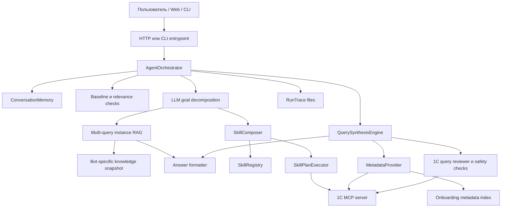

# Архитектура

## Общая Схема



`AgentOrchestrator` - центральная точка принятия решений. Он пишет трассу
каждого запроса, хранит контекст диалога, сначала пробует закрыть уточнение
детерминированно, затем обрабатывает простые общие вопросы, вызывает LLM для
декомпозиции бизнес-цели, пытается собрать план из существующих навыков и
переходит к синтезу запроса, если текущий граф навыков не способен ответить.

## Основные Компоненты

### Web И CLI

Код:

- `src/wiicon5/web/server.py`
- `src/wiicon5/app/factory.py`
- `src/wiicon5/cli/serve.py`
- `src/wiicon5/cli/ask.py`

HTTP-сервис отдает тестовый web-клиент, endpoint `/chat`, health-check,
историю диалога, версию и history-файлы. CLI-скрипты используют тот же core,
что и web-сервис.

### AgentOrchestrator

Код:

- `src/wiicon5/agent/orchestrator.py`

Зоны ответственности:

- добавить сообщение пользователя в контекст;
- записать входные и выходные trace-файлы;
- разрешить ожидающее уточнение без нового обращения к LLM/MCP, если пользователь
  явно выбрал один из предложенных вариантов;
- ответить на базовые общие вопросы;
- отсечь нерелевантные вопросы;
- вызвать декомпозицию цели;
- собрать и выполнить skill plan;
- вызвать query synthesis, если skill plan не дал ответа;
- сохранить ответ и контекстные артефакты.

Частные policy больше не должны жить в orchestrator. Например, разрешение
уточнений вынесено в `src/wiicon5/clarification`, а general/out-of-scope ответы
берутся из bot instance policy.

### Bot Instance

Код и данные:

- `bot_instances/local/bot.yaml`
- `src/wiicon5/bot_instance/config.py`
- `src/wiicon5/policies/...`

Bot instance описывает конкретного бота поверх общего ядра:

- имя бота;
- доменную область;
- тексты самопрезентации и out-of-scope ответов;
- baseline-маркеры;
- подключенные domain hint packs;
- профиль конфигурации и fingerprint.

Ядро агента должно работать через этот профиль и не должно знать, что конкретный
экземпляр называется WIICON ChatBot.

### Контекст Диалога

Код:

- `src/wiicon5/conversation/context.py`
- `src/wiicon5/conversation/memory.py`

Контекст хранит сообщения и typed artifacts: результаты запросов, запросы на
уточнение, ссылки на объекты, таблицы и ответы. Это важно для follow-up
вопросов: агент должен переиспользовать реальные `_objectRef` из MCP, а не
восстанавливать ссылки по текстовому представлению.

### Модель Навыков

Код и данные:

- `skills/atomic/...`
- `skills/bindings/...`
- `skills/learned/...`
- `src/wiicon5/skills/...`
- `src/wiicon5/execution/runtime.py`

Навык - атомарный контракт:

- что он умеет делать;
- какие typed inputs ему нужны;
- какие typed artifacts он производит;
- какую semantic role он представляет;
- какие filter roles он принимает;
- какой implementation strategy используется.

Навыки не должны накапливать большое количество частной бизнес-логики.
Конфигурационно-зависимые имена объектов и полей должны жить в bindings и
metadata evidence.

Текущие классы навыков:

- data acquisition skills;
- deterministic transform skills;
- presentation skills;
- learned query skills.

### Метаданные И Bindings

Код:

- `src/wiicon5/knowledge/metadata.py`
- `src/wiicon5/knowledge/discovery.py`
- `src/wiicon5/knowledge/bindings.py`
- `src/wiicon5/query/semantic_query_builder.py`

Binding связывает semantic skill с конкретным объектом 1С и подтвержденными
полями для конкретного отпечатка конфигурации.

Пример:

- semantic role: `stock_balance`;
- объект 1С: `РегистрНакопления.ТоварыНаСкладах`;
- виртуальная таблица: `Остатки`;
- поля: номенклатура, склад, количество.

Целевое направление: bindings должны обнаруживаться или обучаться по
метаданным, а не превращаться в ручной каталог частных случаев.

### Query Synthesis

Код:

- `src/wiicon5/query_synthesis/synthesizer.py`
- `src/wiicon5/query_synthesis/failure_solver.py`
- `src/wiicon5/query_synthesis/sufficiency.py`
- `src/wiicon5/query_synthesis/term_expansion.py`
- `src/wiicon5/prompting/templates/...`
- `src/wiicon5/query/one_c_query_review.py`
- `src/wiicon5/query/one_c_query_safety.py`
- `src/wiicon5/presentation/llm_answer_formatter.py`

Синтез запроса используется, когда существующие навыки не могут произвести
нужный артефакт. Контролируемый цикл:

1. LLM предлагает термины поиска метаданных и гипотезу.
2. MetadataProvider получает подходящие объекты из MCP.
3. LLM строит read-only запрос 1С только по подтвержденным метаданным.
4. Query reviewer проверяет типовые ошибки и правила безопасности.
5. Запрос выполняется через MCP.
6. Result sufficiency layer проверяет, отвечает ли результат исходному вопросу.
7. При неоднозначности создается `ClarificationRequest`.
8. Если controlled loop окончательно споткнулся, опциональный failure solver
   получает полный диагностический контекст и может вернуть один новый
   read-only запрос 1С, который проходит те же проверки.
9. Presentation layer формирует ответ пользователю.
10. Полезные артефакты сохраняются в контекст, а успешные шаблоны могут стать
   learned skills.

Failure solver не является механизмом автопатчинга. Если он видит, что нужно
изменять код, валидатор, reviewer или MCP, он возвращает `needs_developer`, а
агент сохраняет диагностический пакет для ручного разбора.

Prompts разделены на слои:

- `core`: универсальные инструкции synthesis/decomposition/repair;
- `one_c`: правила языка запросов 1С и safety;
- `domain_packs`: подключаемые доменные подсказки, например `trade_ru` и
  `wiicon`.

Расширение терминов поиска метаданных также вынесено в policy. Чистый бот может
работать только с `one_c_standard`, а WIICON/local профиль подключает торговые
подсказки отдельно.

### Learned Skills

Новый обобщаемый learned skill после успешного synthesis сразу считается
доступным агенту. Он сохраняется в `skills/learned/active` со статусом
`verified`, добавляется в runtime registry и появляется в каталоге навыков.
Человек не переводит его по длинному lifecycle: он может открыть навык,
поправить описание или implementation/query и сохранить изменения, либо удалить
неудачный навык. Если похожий вопрос снова понадобится, агент создаст навык
заново.

В implementation learned skill хранится:

- `config_fingerprint`;
- `metadata_dependency_contract`;
- evidence: trace, question, hash запроса, hash результата, successful_runs,
  human_confirmed.

Runtime не применяет learned skill к другой конфигурации, если fingerprint явно
не совпадает. Если доступен metadata provider, runtime проверяет, что поля из
metadata dependency contract еще существуют.

### Skill Workbench

Подробная архитектура каталога навыков описана в
[`docs/architecture/skill_workbench.md`](architecture/skill_workbench.md).
Workbench больше не ведет пользователя через статусы candidate/verified/stable.
Он показывает каталог навыков, объясняет назначение каждого skill contract и
дает простые действия для пользовательских/learned навыков: сохранить правку или
удалить. Базовые seed skills из `skills/atomic` защищены от правки в UI.

Ключевое ограничение остается прежним: onboarding hints и LLM reasoning не
считаются подтвержденными metadata fields без MCP/XML evidence.

### Configuration Profile

Код:

- `src/wiicon5/knowledge/config_profile.py`

При `WIICON5_CONFIG_FINGERPRINT=auto` агент строит начальный
`ConfigurationProfile` по доступным метаданным MCP и использует fingerprint вида
`cfg_<hash>`. Ручной fingerprint остается доступен для локальных сценариев и
совместимости с текущими bindings.

### Onboarding

Код:

- `src/wiicon5/onboarding/...`
- `src/wiicon5/cli/onboard_config.py`
- `scripts/onboard_config.py`

Onboarding читает выгрузку конфигурации в файлах и создает только candidates:

- `metadata_index.sqlite`;
- `candidate_bindings.json`;
- `candidate_semantic_roles.json`;
- `candidate_query_patterns.jsonl`;
- `register_usage_map.json`;
- `training_status.json`;
- `onboarding_report.md`.

Этот слой не утверждает skills/bindings автоматически. Его задача - дать агенту
и разработчику карту конфигурации, словарь и кандидаты для последующей проверки.

После построения `metadata_index.sqlite` runtime подключает его через
`IndexedMetadataProvider`: MCP остается главным источником подробных метаданных,
но локальный индекс используется как fallback при поиске объектов. Это снижает
вероятность, что агент не найдет объект только из-за слабого поиска MCP.

Список объектов и подтвержденных полей в onboarding строится по XML-выгрузке 1С:
`Catalogs/`, `Documents/`, `AccumulationRegisters/`, `InformationRegisters/`.
XML-derived поля получают `trust=verified`, а поля, найденные regex по исходным
текстам, остаются `trust=hint`. Reviewer не принимает `hint` как доказательство
существования таблицы или поля для финального запроса.

`candidate_query_patterns.jsonl` и `register_usage_map.json` подключаются к
`QuerySynthesisEngine` как onboarding evidence. Это навигационные примеры из
конфигурации, а не разрешение использовать неподтвержденные поля: итоговый query
все равно должен пройти через metadata review.

Кандидаты bindings можно проверить отдельным verifier-скриптом через MCP. Он
пишет `verified_binding_candidates.json`, кеширует проверки по уникальному
объекту и не активирует bindings автоматически.

### Regression Learning Loop

Код:

- `src/wiicon5/regression/...`
- `scripts/trace_to_case.py`
- `scripts/run_regression.py`

Trace можно превратить в regression case. Runner поддерживает два режима:
валидацию формата case pack и replay через агента. Replay проверяет source,
тип artifact, ожидаемые колонки, уточнения и запрещенные объекты метаданных.
Regression replay остается инструментом контроля качества после изменения или
удаления навыков, но больше не является обязательным шагом promotion workflow.

### Skill Composer Explainability

`SkillComposer` теперь возвращает `search_trace`, а orchestrator пишет его в
`skill_search/composer_trace.json`. В trace видно:

- какой artifact требовался;
- какой skill выбран;
- какие candidates рассматривались;
- score;
- reasons;
- rejection_reason.

### Проверка Запросов 1С

Reviewer ловит предсказуемые ошибки до выполнения через MCP:

- поля не подтверждены метаданными;
- ссылочное поле сравнивается со строкой;
- неверные параметры виртуальной таблицы регистра накопления;
- неподтвержденные значения перечислений;
- попытка запроса к объекту, который не является источником данных;
- небезопасные операции изменения данных.

Reviewer не заменяет выполнение запроса. Это защитный слой, который снижает
количество очевидно неверных LLM-запросов.

### MCP

Код:

- `src/wiicon5/mcp/client.py`
- `src/wiicon5/mcp/contracts.py`

MCP-сервер - мост к 1С. Агент использует его для:

- поиска метаданных;
- выполнения read-only запросов;
- переиспользования `_objectRef`.

Локальный URL по умолчанию:

```text
http://127.0.0.1:6003
```

### Трассировка

Код:

- `src/wiicon5/audit/trace_writer.py`

Каждый запрос создает папку `runs/agent_*`. Типовые файлы:

- `input/user_message.json`;
- `input/conversation_packet.json`;
- `intent/intent_response.json`;
- `intent/goal_decomposition.json`;
- `skill_plan/plan_graph.json`;
- `skill_invocations/execution_result.json`;
- `query_synthesis/...`;
- `diagnostics/query_synthesis_failure.json`;
- `clarification/resolution.json`;
- `result/result.json`.

Trace - главный диагностический артефакт. Он показывает, что агент знал, что
передавал в LLM, какой запрос построил, что вернул MCP и почему результат был
принят, отвергнут или превращен в уточняющий вопрос.

## Пайплайн Запроса

1. Пользователь отправляет сообщение.
2. Сообщение и текущий контекст пишутся в trace.
3. Если есть ожидающее уточнение, агент пробует закрыть его из сохраненных
   артефактов.
4. Выполняются general/out-of-scope проверки.
5. LLM декомпозирует сообщение в intent и typed business goal.
6. Composer пытается собрать план из существующих навыков.
7. Если план есть, runtime выполняет его.
8. Если план не найден или выполнение не дало ответа, query synthesis пытается
   получить ответ через метаданные и MCP.
9. Sufficiency layer проверяет, что возвращенные факты отвечают вопросу.
10. Presentation layer формирует человекочитаемый ответ.
11. Контекст и trace сохраняются.

## Semantic Skill Contract

Каждый новый learned skill содержит контракт версии 2, независимый от имен
объектов конкретной конфигурации 1С:

- subject terms;
- operation: lookup, list, balance, aggregate или rank;
- measures и точные aggregation semantics;
- grain и dimensions;
- обязательные и опциональные filter roles;
- fixed filter values;
- result columns;
- ranking direction, limit и measure.

Composer допускает learned skill в план только при совместимости этого
контракта с текущей целью. Текстовый similarity сам по себе не является
основанием для переиспользования.

## Learning Gate

Успешный ответ не равен новому навыку. Перед записью в active каталог gate
проверяет safety запроса, schema контракта, соответствие query контракту,
sufficiency, exact execution evidence, negative semantic probes, metadata
dependencies и fingerprint конфигурации.

Metadata dependency описывает форму источника: базовый объект, табличную часть
документа или виртуальную таблицу регистра. Поэтому поля строк документа и
производные поля `*Остаток`/`*Оборот` проверяются по соответствующей схеме, а не
как реквизиты шапки или физической таблицы регистра.

Навык хранит полный выполненный query template. Runtime меняет только параметры,
для которых доказана связь с semantic filters; структура JOIN/WHERE/GROUP/ORDER
не реконструируется эвристиками.

После warm-выполнения результат снова проходит sufficiency review. Только после
этого артефакты коммитятся в память, ответ возвращается пользователю, а запуск
учитывается как success в runtime health.

Sufficiency layer отклоняет полностью одинаковые строки: такой результат не
позволяет отличить реальные дубли от разных фактов с потерянной размерностью.
Следующий запрос должен вернуть различающие измерения либо агрегировать данные
на требуемом зерне.

Legacy learned skills без контракта v2 перемещаются в `learned/quarantine` и
никогда не загружаются registry.

## Принципы

- Предпочитать метаданные предположениям.
- Предпочитать переиспользуемые навыки одноразовым веткам кода.
- Уточнять неоднозначный бизнес-смысл у пользователя.
- Пропускать LLM-результаты через детерминированную проверку.
- Сохранять raw evidence для разбора ошибок.
- Не превращать ссылку одного типа 1С в ссылку другого типа.
- Не изменять данные 1С.
