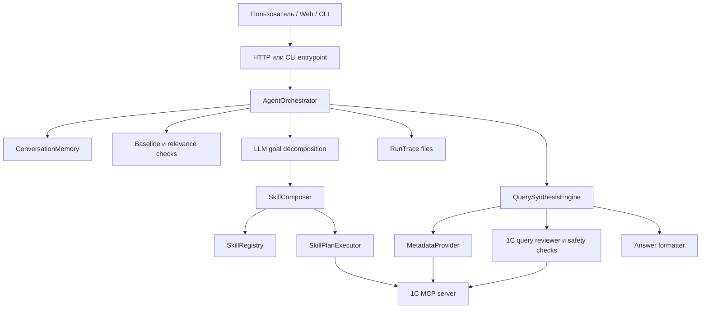

# Архитектура

## Общая Схема



`AgentOrchestrator` - центральная точка принятия решений. Он пишет трассу
каждого запроса, хранит контекст диалога, сначала пробует закрыть уточнение
детерминированно, затем обрабатывает простые общие вопросы, вызывает LLM для
декомпозиции бизнес-цели, пытается собрать план из существующих навыков и
переходит к синтезу запроса, если текущий граф навыков не способен ответить.

## Основные Компоненты

### Web И CLI

Код:

- `src/wiicon5/web/server.py`
- `src/wiicon5/app/factory.py`
- `src/wiicon5/cli/serve.py`
- `src/wiicon5/cli/ask.py`

HTTP-сервис отдает тестовый web-клиент, endpoint `/chat`, health-check,
историю диалога, версию и history-файлы. CLI-скрипты используют тот же core,
что и web-сервис.

### AgentOrchestrator

Код:

- `src/wiicon5/agent/orchestrator.py`

Зоны ответственности:

- добавить сообщение пользователя в контекст;
- записать входные и выходные trace-файлы;
- разрешить ожидающее уточнение без нового обращения к LLM/MCP, если пользователь
  явно выбрал один из предложенных вариантов;
- ответить на базовые общие вопросы;
- отсечь нерелевантные вопросы;
- вызвать декомпозицию цели;
- собрать и выполнить skill plan;
- вызвать query synthesis, если skill plan не дал ответа;
- сохранить ответ и контекстные артефакты.

### Контекст Диалога

Код:

- `src/wiicon5/conversation/context.py`
- `src/wiicon5/conversation/memory.py`

Контекст хранит сообщения и typed artifacts: результаты запросов, запросы на
уточнение, ссылки на объекты, таблицы и ответы. Это важно для follow-up
вопросов: агент должен переиспользовать реальные `_objectRef` из MCP, а не
восстанавливать ссылки по текстовому представлению.

### Модель Навыков

Код и данные:

- `skills/atomic/...`
- `skills/bindings/...`
- `skills/learned/...`
- `src/wiicon5/skills/...`
- `src/wiicon5/execution/runtime.py`

Навык - атомарный контракт:

- что он умеет делать;
- какие typed inputs ему нужны;
- какие typed artifacts он производит;
- какую semantic role он представляет;
- какие filter roles он принимает;
- какой implementation strategy используется.

Навыки не должны накапливать большое количество частной бизнес-логики.
Конфигурационно-зависимые имена объектов и полей должны жить в bindings и
metadata evidence.

Текущие классы навыков:

- data acquisition skills;
- deterministic transform skills;
- presentation skills;
- learned query skills.

### Метаданные И Bindings

Код:

- `src/wiicon5/knowledge/metadata.py`
- `src/wiicon5/knowledge/discovery.py`
- `src/wiicon5/knowledge/bindings.py`
- `src/wiicon5/query/semantic_query_builder.py`

Binding связывает semantic skill с конкретным объектом 1С и подтвержденными
полями для конкретного отпечатка конфигурации.

Пример:

- semantic role: `stock_balance`;
- объект 1С: `РегистрНакопления.ТоварыНаСкладах`;
- виртуальная таблица: `Остатки`;
- поля: номенклатура, склад, количество.

Целевое направление: bindings должны обнаруживаться или обучаться по
метаданным, а не превращаться в ручной каталог частных случаев.

### Query Synthesis

Код:

- `src/wiicon5/query_synthesis/synthesizer.py`
- `src/wiicon5/query_synthesis/sufficiency.py`
- `src/wiicon5/query/one_c_query_review.py`
- `src/wiicon5/query/one_c_query_safety.py`
- `src/wiicon5/presentation/llm_answer_formatter.py`

Синтез запроса используется, когда существующие навыки не могут произвести
нужный артефакт. Контролируемый цикл:

1. LLM предлагает термины поиска метаданных и гипотезу.
2. MetadataProvider получает подходящие объекты из MCP.
3. LLM строит read-only запрос 1С только по подтвержденным метаданным.
4. Query reviewer проверяет типовые ошибки и правила безопасности.
5. Запрос выполняется через MCP.
6. Result sufficiency layer проверяет, отвечает ли результат исходному вопросу.
7. При неоднозначности создается `ClarificationRequest`.
8. Presentation layer формирует ответ пользователю.
9. Полезные артефакты сохраняются в контекст, а успешные шаблоны могут стать
   learned skills.

### Проверка Запросов 1С

Reviewer ловит предсказуемые ошибки до выполнения через MCP:

- поля не подтверждены метаданными;
- ссылочное поле сравнивается со строкой;
- неверные параметры виртуальной таблицы регистра накопления;
- неподтвержденные значения перечислений;
- попытка запроса к объекту, который не является источником данных;
- небезопасные операции изменения данных.

Reviewer не заменяет выполнение запроса. Это защитный слой, который снижает
количество очевидно неверных LLM-запросов.

### MCP

Код:

- `src/wiicon5/mcp/client.py`
- `src/wiicon5/mcp/contracts.py`

MCP-сервер - мост к 1С. Агент использует его для:

- поиска метаданных;
- выполнения read-only запросов;
- переиспользования `_objectRef`.

Локальный URL по умолчанию:

```text
http://127.0.0.1:6003
```

### Трассировка

Код:

- `src/wiicon5/audit/trace_writer.py`

Каждый запрос создает папку `runs/agent_*`. Типовые файлы:

- `input/user_message.json`;
- `input/conversation_packet.json`;
- `intent/intent_response.json`;
- `intent/goal_decomposition.json`;
- `skill_plan/plan_graph.json`;
- `skill_invocations/execution_result.json`;
- `query_synthesis/...`;
- `clarification/resolution.json`;
- `result/result.json`.

Trace - главный диагностический артефакт. Он показывает, что агент знал, что
передавал в LLM, какой запрос построил, что вернул MCP и почему результат был
принят, отвергнут или превращен в уточняющий вопрос.

## Пайплайн Запроса

1. Пользователь отправляет сообщение.
2. Сообщение и текущий контекст пишутся в trace.
3. Если есть ожидающее уточнение, агент пробует закрыть его из сохраненных
   артефактов.
4. Выполняются general/out-of-scope проверки.
5. LLM декомпозирует сообщение в intent и typed business goal.
6. Composer пытается собрать план из существующих навыков.
7. Если план есть, runtime выполняет его.
8. Если план не найден или выполнение не дало ответа, query synthesis пытается
   получить ответ через метаданные и MCP.
9. Sufficiency layer проверяет, что возвращенные факты отвечают вопросу.
10. Presentation layer формирует человекочитаемый ответ.
11. Контекст и trace сохраняются.

## Принципы

- Предпочитать метаданные предположениям.
- Предпочитать переиспользуемые навыки одноразовым веткам кода.
- Уточнять неоднозначный бизнес-смысл у пользователя.
- Пропускать LLM-результаты через детерминированную проверку.
- Сохранять raw evidence для разбора ошибок.
- Не превращать ссылку одного типа 1С в ссылку другого типа.
- Не изменять данные 1С.
